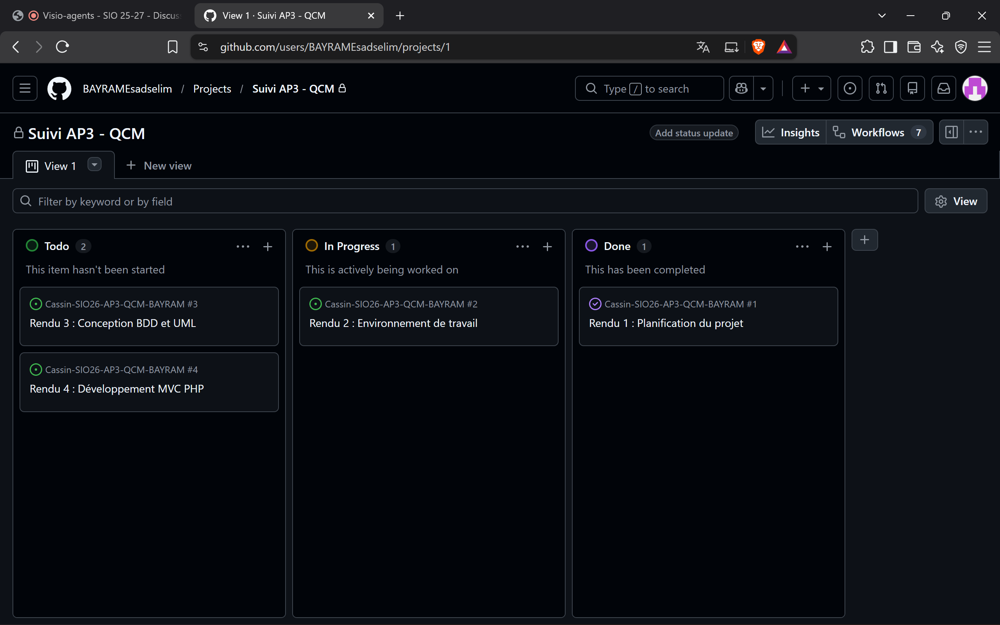

# Planification du projet QCM

---

**Date de création** : 05/10/2026 - E. BAYRAM  
**Date de modification** : 05/10/2026 - E. BAYRAM  
**Sommaire :**

> [TOC]

## 1. Présentation du projet

Le projet consiste à développer une plateforme de gestion et de passage de QCM en ligne en PHP (architecture MVC) pour l'Atelier de Professionnalisation 3 (BTS SIO SLAM).

## 2. Découpage des tâches et Diagramme de GANTT

| ID | Phase / Tâche | Responsable | Date début | Date fin | Statut |
|---|---|---|---|---|---|
| **P1** | **Phase 1 : Planification & Environnement** | Groupe | 28/09/2026 | 12/10/2026 | En cours |
| T1.1 | Rédaction du document de planification | Esadselim | 05/10/2026 | 12/10/2026 | Terminé |
| T1.2 | Rédaction de la documentation d'installation | Raphaël | 05/10/2026 | 12/10/2026 | En cours |
| T1.3 | Saisie des Milestones/Issues dans GitHub Projects | Mattéo | 05/10/2026 | 12/10/2026 | Terminé |
| **P2** | **Phase 2 : Conception (UML & BDD)** | Groupe | 13/10/2026 | 16/11/2026 | À faire |
| T2.1 | Réalisation du schéma E/A et Modèle Relationnel | Groupe | 13/10/2026 | 25/10/2026 | À faire |
| T2.2 | Maquettes et diagrammes de cas d'utilisation | Groupe | 26/10/2026 | 16/11/2026 | À faire |
| **P3** | **Phase 3 : Développement MVC** | Groupe | 17/11/2026 | 04/01/2027 | À faire |
| T3.1 | Script SQL de création de BDD et jeu de données | Groupe | 17/11/2026 | 25/11/2026 | À faire |
| T3.2 | Développement du système de Router et Core MVC | Groupe | 26/11/2026 | 05/12/2026 | À faire |
| T3.3 | CRUD Matières, Comptes et Classes (Admin) | Groupe | 06/12/2026 | 15/12/2026 | À faire |
| T3.4 | CRUD Questions et création de QCM (Formateur) | Groupe | 16/12/2026 | 25/12/2026 | À faire |
| T3.5 | Interface de passage de QCM (Étudiant) | Groupe | 26/12/2026 | 04/01/2027 | À faire |

## 3. Suivi sur GitHub

L'ensemble des étapes (*Milestones*) et des tâches (*Issues*) sont saisies et suivies directement sur le dépôt GitHub.

### 3.1. Suivi des jalons (Milestones)

### 3.2. Tableau de suivi des tâches (Kanban / Projects)

